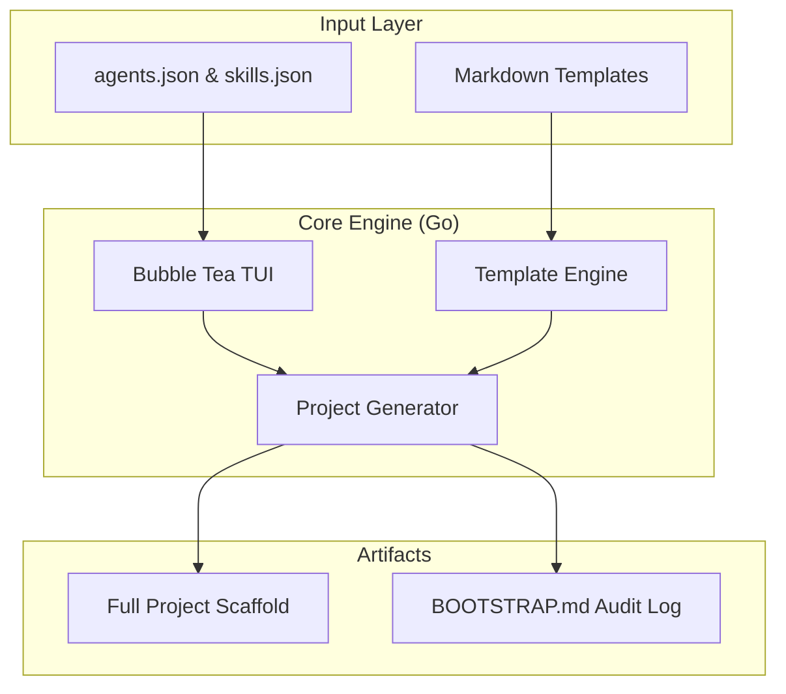

<div align="center">

# Msingi

**Context engineering infrastructure for AI agent sessions.**

*Msingi* is Swahili for **foundation** — the groundwork you lay before building.

[](LICENSE)
[](main.go)
[](#)
[](#)

**Built in Accra. Designed for everywhere.**

</div>

---

## The Problem
The real cost of AI coding tools is the tokens burned on unstructured exploration. Every cold session costs tokens that should go to creation. 

**Msingi generates the context foundation in 60 seconds.**

## Modern Architecture (Go Migration)
Msingi has evolved from a collection of scripts into a high-performance, data-driven engine built in Go.



- **Go (Canonical)**: Handles structured JSON parsing, metadata injection, and high-fidelity TUI rendering. This is the recommended entry point for all users.
- **Bash (Lightweight)**: Preserves zero-dependency, offline-first portability. Used as a lightweight stub for minimal scaffolding in constrained environments.

## TUI Features
The Msingi interactive wizard provides a premium onboarding experience:
- **Guided Setup**: 7 screens covering Project Mode, Type, Details, Intake, Agents, and Skills.
- **Context Pressure Preview**: Live estimation of token usage for your current selections (Toggle with `p`).
- **Skill Inference**: Real-time matching of project metadata against the skill registry to suggest relevant capabilities.
- **Responsive Design**: Auto-adjusting layouts with sidebars, progress indicators, and paginated lists.

## Installation

### From Source (Go)
```bash
git clone https://github.com/xdagee/msingi
cd msingi
go build -o msingi
./msingi
```

### Windows (PowerShell 7)
```powershell
.\install.ps1
bootstrap
```

### macOS / Linux (Lightweight Bash)
```bash
chmod +x msingi.sh
sudo ln -s "$(pwd)/msingi.sh" /usr/local/bin/msingi
msingi
```

## Developer Ergonomics
- `--dry-run`: Preview all file actions without touching the disk.
- `--verbose`: Enable detailed logging and template validation.
- `--template-dir`: Hot-reload local templates during development.

---

## For AI Agents
If you are an AI agent working on this repository, please start by reading [**AGENTS.md**](AGENTS.md).

---

<div align="center">

*Msingi — the foundation you lay before you build.*

**Built in Accra. Designed for everywhere.**

</div>
